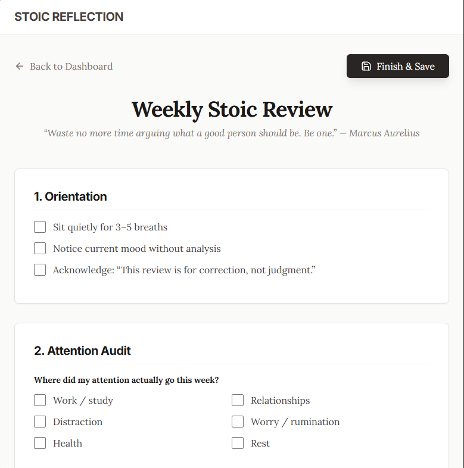

# Stoic Reflection App

A local-first web application designed to facilitate weekly Stoic reviews. This app provides a distraction-free environment to reflect on your week using a structured template inspired by Stoic philosophy.



## Features

*   **Interactive Review Form:** A guided, step-by-step interface for your weekly review, covering orientation, attention audit, emotional review, control check, and more.
*   **Local & Private:** Your data is yours. All reflections are stored as JSON files directly on your local machine (`/data` directory).
*   **Dashboard:** View a chronological list of your past reflections.
*   **Minimalist Design:** A clean, typography-focused UI (using Lora and Inter fonts) to encourage deep thought and focus.
*   **Read-Only Mode:** Review past entries in a clear, readable format.

## Prerequisites

*   **Node.js:** Ensure you have Node.js installed on your machine.

## Installation

1.  **Clone the repository:**
    ```bash
    git clone https://github.com/babopeter/stoic-reflections-app.git
    cd stoic-reflections-app
    ```

2.  **Install dependencies:**
    This project is a monorepo containing both the client and server. You can install all dependencies with:
    ```bash
    npm install          # Install root dependencies
    cd client && npm install # Install frontend dependencies
    cd ../server && npm install # Install backend dependencies
    cd ..                # Return to root
    ```

## Usage

1.  **Start the application:**
    Run the following command from the root directory to start both the backend server and the frontend client simultaneously:
    ```bash
    npm start
    ```

2.  **Open in Browser:**
    The application will typically open at `http://localhost:5173` (or the port specified by Vite in your terminal).
    The backend API runs on `http://localhost:3001`.

## Project Structure

*   `client/`: React frontend (Vite + Tailwind CSS).
*   `server/`: Express backend for handling local file storage.
*   `data/`: Directory where your reflections are saved as JSON files.

## Tech Stack

*   **Frontend:** React, Vite, Tailwind CSS, Lucide React
*   **Backend:** Node.js, Express
*   **Storage:** Local File System (JSON)

## License

MIT
